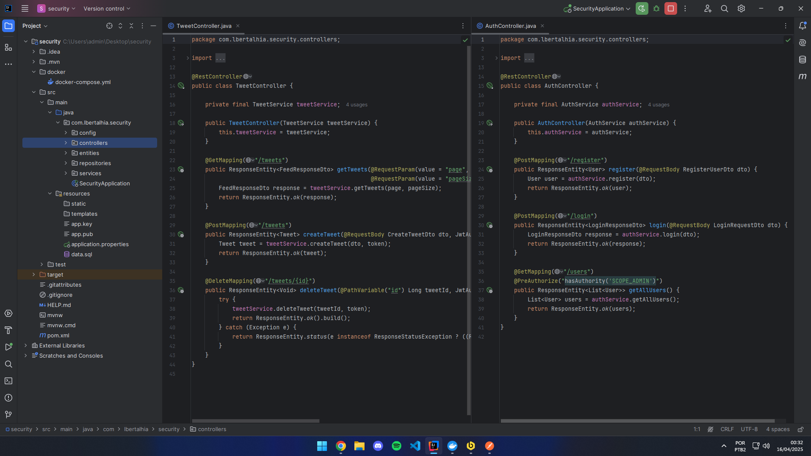
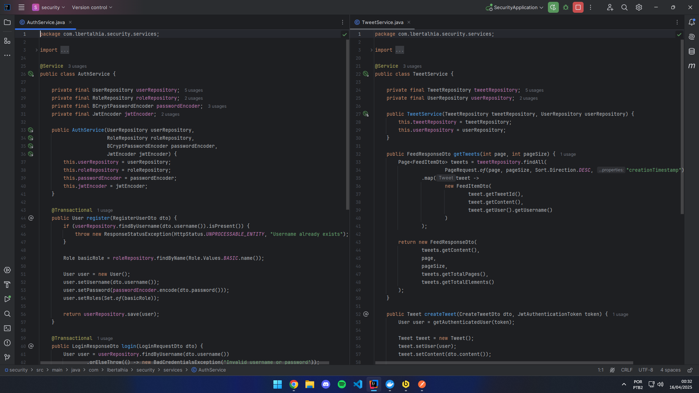
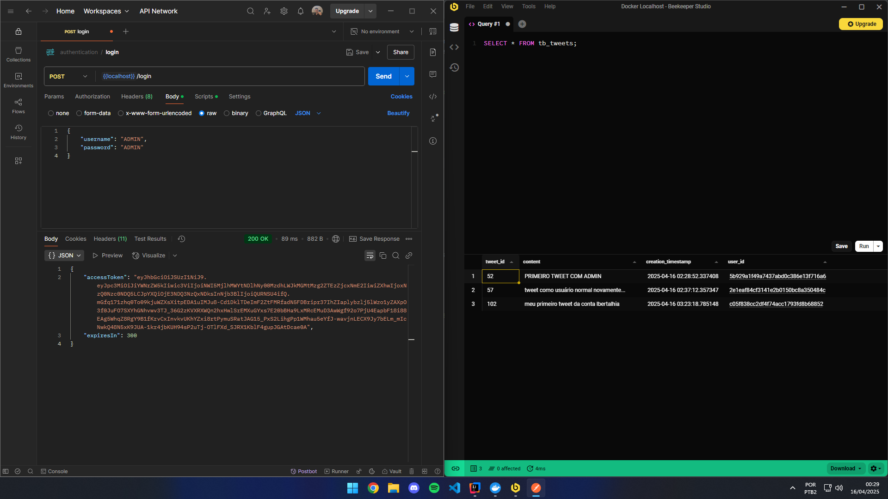

<h1 align="center">Spring Boot Security Project</h1>

<p align="center">
  
  
  
  
  
  
  
  
</p>

<p align="center">
  Projeto de demonstração para implementação de segurança com Spring Boot. Inclui funcionalidades de autenticação JWT, login, registro de usuários e gerenciamento de tweets. Utiliza Spring Security, OAuth2, JPA e MySQL, com ambiente configurável via Docker.
</p>

## 🚀 Funcionalidades

- **Registro de Usuário**: Criação de contas com senha criptografada usando BCrypt.
- **Login**: Geração de token JWT após login válido.
- **Autenticação JWT**: Proteção de endpoints com segurança baseada em tokens.
- **Gestão de Usuários**: Apenas administradores podem visualizar todos os usuários registrados.
- **Tweets**: Criação, listagem e remoção de tweets para usuários autenticados.

## 🛠️ Tecnologias

- **Spring Boot 3.4.4**
- **Spring Security**
- **Spring Data JPA**
- **JWT (JSON Web Token)**
- **MySQL**
- **Docker e Docker Compose**

## ✅ Pré-requisitos

- Java 21 instalado
- MySQL configurado (ou rodando via Docker)
- Docker e Docker Compose (opcional, mas recomendado)

---

## 🔗 Endpoints

- **POST `/auth/register`** – Registrar um novo usuário
  ```json
  {
    "username": "johndoe",
    "password": "johndoe123"
  }
  ```

- **POST `/auth/login`** – Login do usuário
  ```json
  {
    "username": "johndoe",
    "password": "johndoe123"
  }
  ```

  **Resposta:**
  ```json
  {
    "token": "eyJhbGciOiJIUzI1NiIsInR5cCI6IkpXVCJ9...",
    "expiresIn": 300
  }
  ```

- **GET `/users`** – Listar todos os usuários (apenas administradores)  
  **Autenticação:** Bearer Token

- **GET `/tweets`** – Listar tweets com paginação (`pageSize`, `page`)  
  **Autenticação:** Bearer Token

- **POST `/tweets`** – Criar novo tweet
  ```json
  {
    "content": "meu primeiro tweet da conta lbertalhia"
  }
  ```

  **Autenticação:** Bearer Token

- **DELETE `/tweets/{tweetId}`** – Deletar tweet por ID  
  **Autenticação:** Bearer Token

---

## 📸 Estrutura do Projeto

### Controllers


### Services


### Infrastructure


---

## 🤝 Como contribuir

1. Faça um fork do projeto
2. Crie uma branch: `git checkout -b minha-feature`
3. Faça suas alterações e commit: `git commit -m 'feat: minha nova feature'`
4. Envie a branch: `git push origin minha-feature`
5. Abra um Pull Request ✨

---

## 📄 Licença

Este projeto está sob a licença [MIT](./LICENSE).